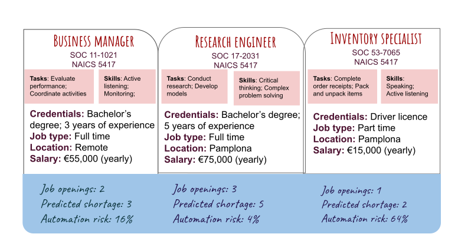

# HP-CEP
* (NAICS-5417 'Scientific Research and Development Services')

* Engineering activities: Conducting original investigation; Experimental development; Modeling and simulation. 
* Operations activities: Setting up, maintaining and repairing machines; Handling inventory; Finishing products.
* Support activities: Finance; Accounting; HR; Marketing; Management.

